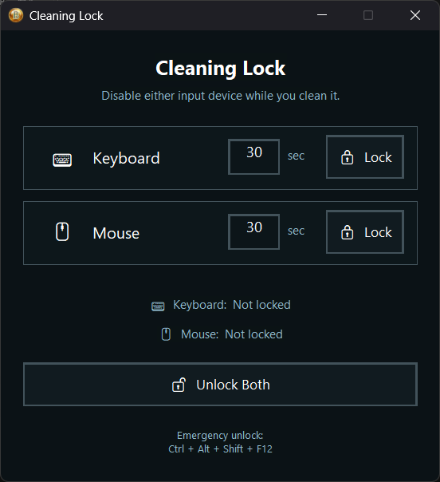

# Cleaning Lock

This AutoHotkey utility that temporarily locks your keyboard or mouse while you clean it. Set a duration, lock the device you are cleaning, and the app restores input automatically when the countdown ends.

It provides a dedicated emergency unlock shortcut if you need to quickly unlock your devices via `Ctrl` + `Alt` + `Shift` + `F12`.

Mouse locking blocks pointer movement, buttons, and wheel input until it is released. When the mouse is locked, you can utilize the `Tab` key to cycle the button selections, the `Enter`, `Numpad Enter`, or `Space` keys to use the button selections, and you can disable the lock using the emergency unlock feature. Keyboard locking suppresses normal keyboard input until its timer expires.

## Controls
| Action | Control |
| --- | --- |
| Lock keyboard | `Lock` in the Keyboard row |
| Lock mouse | `Lock` in the Mouse row |
| Unlock mouse early | `Enter`, `Numpad Enter`, or `Space` |
| Emergency unlock | `Ctrl` + `Alt` + `Shift` + `F12` |

## Get the Cleaning Lock
### Download `v1.0.0`

[Download Cleaning Lock v1.0.0](https://github.com/BehrRiley/cleaning-lock/releases/tag/v1.0.0) from the repository's Releases page.

`v1.0.0` is the only published build.

### Run from source
1. Install [AutoHotkey v2](https://www.autohotkey.com/) on Windows
2. Keep `favicon.ico` in the same folder as `safewipe_input_blocker.ahk`
3. Double-click `safewipe_input_blocker.ahk`, or run it with AutoHotkey v2

## Usage
1. Enter a positive whole-number duration in seconds
2. Select `Lock` beside `Keyboard` or `Mouse`
3. Clean the selected device while the countdown is active
4. The device unlocks when the timer reaches zero. Use `Unlock` or `Unlock Both` to end a lock early when available

> **Note**: This tool is intended for temporary cleaning convenience, not as a security or access-control mechanism.
